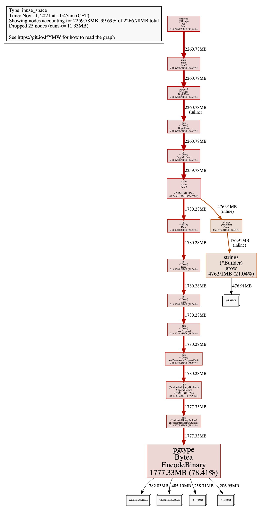

# Log

```
$ GODEBUG="gctrace=1" GOTRACEBACK=all go run .
gc 1 @0.024s 0%: 0.023+0.41+0.053 ms clock, 0.38+0.48/0.54/0.007+0.85 ms cpu, 4->4->0 MB, 5 MB goal, 16 P
gc 2 @0.027s 1%: 0.067+0.38+0.054 ms clock, 1.0+0.43/0.46/0+0.87 ms cpu, 4->4->0 MB, 5 MB goal, 16 P
gc 3 @0.030s 1%: 0.085+0.75+0.057 ms clock, 1.3+0.43/0.56/0+0.91 ms cpu, 4->4->0 MB, 5 MB goal, 16 P
gc 4 @0.034s 2%: 0.12+0.44+0.052 ms clock, 2.0+0.28/0.51/0+0.84 ms cpu, 4->4->0 MB, 5 MB goal, 16 P
gc 5 @0.036s 2%: 0.040+0.47+0.044 ms clock, 0.64+0.76/0.56/0+0.70 ms cpu, 4->4->0 MB, 5 MB goal, 16 P
gc 6 @0.039s 2%: 0.085+0.39+0.030 ms clock, 1.3+0.40/0.52/0+0.49 ms cpu, 4->4->0 MB, 5 MB goal, 16 P
gc 7 @0.041s 2%: 0.059+0.57+0.029 ms clock, 0.95+0.56/0.69/0+0.46 ms cpu, 4->4->1 MB, 5 MB goal, 16 P
gc 8 @0.044s 3%: 0.078+0.56+0.006 ms clock, 1.2+0.74/0.54/0+0.098 ms cpu, 4->4->0 MB, 5 MB goal, 16 P
gc 9 @0.046s 3%: 0.083+0.56+0.036 ms clock, 1.3+0.66/0.64/0+0.59 ms cpu, 4->4->1 MB, 5 MB goal, 16 P
gc 10 @0.048s 3%: 0.051+0.34+0.030 ms clock, 0.81+0.17/0.72/0.084+0.49 ms cpu, 4->4->0 MB, 5 MB goal, 16 P
gc 11 @0.057s 3%: 0.034+0.20+0.013 ms clock, 0.55+0.060/0.43/0.42+0.21 ms cpu, 4->4->0 MB, 5 MB goal, 16 P
gc 12 @0.083s 2%: 0.064+0.55+0.047 ms clock, 1.0+0.41/1.1/0+0.75 ms cpu, 4->4->0 MB, 5 MB goal, 16 P
gc 13 @0.085s 2%: 0.067+0.62+0.046 ms clock, 1.0+0.41/0.88/0+0.74 ms cpu, 4->4->1 MB, 5 MB goal, 16 P
gc 14 @0.087s 2%: 0.049+0.66+0.034 ms clock, 0.79+0.19/0.93/0+0.55 ms cpu, 4->4->1 MB, 5 MB goal, 16 P
gc 15 @0.090s 2%: 0.056+0.65+0.044 ms clock, 0.90+0.52/1.0/0.071+0.71 ms cpu, 4->4->1 MB, 5 MB goal, 16 P
gc 16 @0.092s 3%: 0.085+0.56+0.058 ms clock, 1.3+0.89/1.2/0.43+0.93 ms cpu, 4->4->1 MB, 5 MB goal, 16 P
gc 17 @0.095s 3%: 0.055+0.53+0.038 ms clock, 0.88+0.68/1.2/0.072+0.61 ms cpu, 4->4->1 MB, 5 MB goal, 16 P
gc 18 @0.099s 3%: 0.094+0.69+0.054 ms clock, 1.5+0.90/1.5/0.063+0.86 ms cpu, 4->4->1 MB, 5 MB goal, 16 P
gc 19 @0.103s 3%: 0.051+0.88+0.029 ms clock, 0.83+0.34/1.7/0.40+0.46 ms cpu, 4->5->1 MB, 5 MB goal, 16 P
gc 20 @0.105s 3%: 0.047+0.67+0.059 ms clock, 0.75+0.46/1.3/0.65+0.95 ms cpu, 4->4->1 MB, 5 MB goal, 16 P
gc 21 @0.108s 3%: 0.050+0.63+0.028 ms clock, 0.80+0.22/1.6/1.1+0.45 ms cpu, 4->5->2 MB, 5 MB goal, 16 P
gc 22 @0.110s 3%: 0.047+0.58+0.037 ms clock, 0.76+0.76/1.4/0.92+0.59 ms cpu, 4->4->2 MB, 5 MB goal, 16 P
gc 23 @0.113s 3%: 0.050+0.57+0.027 ms clock, 0.80+0.44/1.4/0.88+0.43 ms cpu, 4->4->2 MB, 5 MB goal, 16 P
gc 24 @0.115s 4%: 0.054+0.70+0.023 ms clock, 0.86+0.51/1.6/1.1+0.38 ms cpu, 4->5->2 MB, 5 MB goal, 16 P
gc 25 @0.118s 4%: 0.12+0.47+0.037 ms clock, 1.9+0.29/1.3/1.2+0.60 ms cpu, 4->4->2 MB, 5 MB goal, 16 P
gc 26 @0.121s 4%: 0.053+0.55+0.019 ms clock, 0.85+0.44/1.4/1.1+0.31 ms cpu, 4->4->2 MB, 5 MB goal, 16 P
gc 27 @0.124s 4%: 0.028+0.53+0.022 ms clock, 0.44+0.23/1.5/1.1+0.35 ms cpu, 4->4->2 MB, 5 MB goal, 16 P
gc 28 @0.125s 4%: 0.057+0.93+0.079 ms clock, 0.91+1.1/1.8/0.069+1.2 ms cpu, 4->5->2 MB, 5 MB goal, 16 P
gc 29 @0.127s 4%: 0.070+1.0+0.054 ms clock, 1.1+0.99/3.0/0.18+0.87 ms cpu, 4->5->2 MB, 5 MB goal, 16 P
gc 30 @0.135s 4%: 0.037+0.63+0.002 ms clock, 0.60+0.13/1.5/2.5+0.044 ms cpu, 5->5->2 MB, 6 MB goal, 16 P
gc 31 @0.145s 5%: 0.72+11+0.10 ms clock, 11+3.1/16/5.4+1.7 ms cpu, 4->5->2 MB, 5 MB goal, 16 P
gc 32 @0.190s 4%: 0.27+0.90+0.002 ms clock, 4.3+1.0/2.8/1.6+0.033 ms cpu, 5->6->3 MB, 6 MB goal, 16 P
gc 33 @0.194s 4%: 0.22+0.74+0.002 ms clock, 3.5+0.18/2.0/2.7+0.035 ms cpu, 6->7->2 MB, 7 MB goal, 16 P
gc 34 @0.202s 4%: 0.042+0.75+0.003 ms clock, 0.67+0.11/2.0/3.5+0.060 ms cpu, 5->5->2 MB, 6 MB goal, 16 P
gc 35 @0.207s 4%: 0.31+0.99+0.038 ms clock, 4.9+0.92/2.7/1.0+0.61 ms cpu, 5->6->3 MB, 6 MB goal, 16 P
gc 36 @0.210s 4%: 0.14+0.93+0.025 ms clock, 2.3+0.61/2.9/0.95+0.40 ms cpu, 7->8->4 MB, 8 MB goal, 16 P
gc 37 @0.214s 4%: 0.10+0.86+0.14 ms clock, 1.6+0.67/2.2/1.9+2.2 ms cpu, 7->8->3 MB, 8 MB goal, 16 P
gc 38 @0.216s 5%: 0.16+1.3+0.10 ms clock, 2.6+0.51/3.8/0.38+1.6 ms cpu, 6->8->4 MB, 7 MB goal, 16 P
gc 39 @0.219s 5%: 0.10+0.99+0.091 ms clock, 1.6+0.94/2.5/1.1+1.4 ms cpu, 8->9->4 MB, 9 MB goal, 16 P
gc 40 @0.223s 5%: 0.058+0.86+0.091 ms clock, 0.93+0.35/2.6/2.2+1.4 ms cpu, 7->8->3 MB, 8 MB goal, 16 P
gc 41 @0.226s 5%: 0.090+1.3+0.16 ms clock, 1.4+0.32/3.1/1.9+2.5 ms cpu, 6->7->3 MB, 7 MB goal, 16 P
# github.com/atombender/pgx-memory-issue
gc 1 @0.008s 2%: 0.015+1.9+0.056 ms clock, 0.25+0.14/2.2/2.3+0.90 ms cpu, 4->4->3 MB, 5 MB goal, 16 P
gc 2 @0.019s 2%: 0.016+1.7+0.073 ms clock, 0.26+0.26/4.2/1.9+1.1 ms cpu, 5->6->5 MB, 6 MB goal, 16 P
gc 42 @0.298s 4%: 0.25+0.90+0.009 ms clock, 4.0+0.27/2.4/2.6+0.15 ms cpu, 5->5->2 MB, 6 MB goal, 16 P
# github.com/atombender/pgx-memory-issue
gc 1 @0.001s 5%: 0.009+1.1+0.003 ms clock, 0.15+0.12/2.4/0.86+0.053 ms cpu, 4->6->5 MB, 5 MB goal, 16 P
gc 2 @0.011s 2%: 0.010+1.0+0.003 ms clock, 0.17+0.071/2.4/0.94+0.052 ms cpu, 9->10->8 MB, 10 MB goal, 16 P
gc 3 @0.017s 2%: 0.018+1.1+0.016 ms clock, 0.30+0.11/1.5/0.49+0.27 ms cpu, 17->17->16 MB, 18 MB goal, 16 P
gc 4 @0.151s 0%: 0.037+3.1+0.014 ms clock, 0.59+0/2.3/2.0+0.23 ms cpu, 32->35->19 MB, 33 MB goal, 16 P
2021/11/11 12:49:25 inserting...
2021/11/11 12:49:25 inserting...
2021/11/11 12:49:25 inserting...
2021/11/11 12:49:25 inserting...
2021/11/11 12:49:25 inserting...
gc 1 @0.012s 1%: 0.029+0.62+0.040 ms clock, 0.47+0.67/0.98/0.23+0.64 ms cpu, 4->4->1 MB, 5 MB goal, 16 P
gc 2 @0.014s 3%: 0.097+1.0+0.033 ms clock, 1.5+0.16/2.9/2.2+0.52 ms cpu, 4->4->2 MB, 5 MB goal, 16 P
gc 3 @0.021s 3%: 0.047+1.5+0.004 ms clock, 0.76+0/2.9/5.8+0.069 ms cpu, 5->7->6 MB, 6 MB goal, 16 P
gc 4 @0.025s 4%: 0.31+1.9+0.013 ms clock, 5.1+0.63/1.9/2.3+0.21 ms cpu, 12->15->15 MB, 13 MB goal, 16 P
gc 5 @0.030s 5%: 0.47+5.1+0.013 ms clock, 7.6+0.31/4.9/3.3+0.21 ms cpu, 26->33->33 MB, 30 MB goal, 16 P
gc 6 @0.042s 9%: 2.3+6.5+0.013 ms clock, 37+0.66/5.5/2.4+0.21 ms cpu, 59->76->76 MB, 67 MB goal, 16 P
gc 7 @0.056s 15%: 3.9+17+4.1 ms clock, 62+0/4.5/3.4+65 ms cpu, 122->210->210 MB, 152 MB goal, 16 P
gc 8 @0.096s 15%: 5.8+31+0.015 ms clock, 93+0/19/3.2+0.24 ms cpu, 338->468->468 MB, 420 MB goal, 16 P
gc 9 @0.174s 12%: 6.5+57+0.022 ms clock, 104+0/54/1.4+0.35 ms cpu, 830->1037->1037 MB, 936 MB goal, 16 P
gc 10 @0.331s 7%: 0.099+133+0.021 ms clock, 1.5+0/63/4.0+0.34 ms cpu, 1701->2229->2227 MB, 2074 MB goal, 16 P
gc 11 @0.678s 4%: 3.2+202+0.006 ms clock, 52+1.0/33/1.8+0.10 ms cpu, 3585->4753->3908 MB, 4455 MB goal, 16 P
2021/11/11 12:49:29 inserted 10000
2021/11/11 12:49:29 inserted 10000
2021/11/11 12:49:29 inserted 10000
2021/11/11 12:49:29 inserted 10000
2021/11/11 12:49:29 inserted 10000
2021/11/11 12:49:29 idle, trying to GC
gc 12 @3.702s 1%: 0.037+0.69+0.002 ms clock, 0.59+0/1.3/0.39+0.036 ms cpu, 4211->4211->2527 MB, 7816 MB goal, 16 P (forced)
2021/11/11 12:49:29 heap=2650028112
gc 13 @3.704s 1%: 0.055+0.63+0.002 ms clock, 0.88+0/0.83/0.71+0.038 ms cpu, 2527->2527->2527 MB, 5054 MB goal, 16 P (forced)
2021/11/11 12:49:29 heap=2650028096
gc 14 @3.704s 1%: 0.045+0.77+0.002 ms clock, 0.72+0/0.60/0.78+0.037 ms cpu, 2527->2527->2527 MB, 5054 MB goal, 16 P (forced)
2021/11/11 12:49:29 heap=2650028096
gc 15 @3.706s 1%: 0.043+0.83+0.001 ms clock, 0.69+0/1.1/0.087+0.028 ms cpu, 2527->2527->2527 MB, 5054 MB goal, 16 P (forced)
2021/11/11 12:49:29 heap=2650028096
gc 16 @3.707s 1%: 0.072+0.85+0.002 ms clock, 1.1+0/1.1/0.18+0.032 ms cpu, 2527->2527->2527 MB, 5054 MB goal, 16 P (forced)
2021/11/11 12:49:29 heap=2650028104
2021/11/11 12:49:29 closed pool
gc 17 @3.796s 1%: 0.063+0.31+0.003 ms clock, 1.0+0/0.60/0.59+0.050 ms cpu, 2527->2527->0 MB, 5054 MB goal, 16 P (forced)
2021/11/11 12:49:29 heap=    401664
gc 18 @3.797s 1%: 0.036+0.28+0.003 ms clock, 0.58+0/0.51/0.41+0.059 ms cpu, 0->0->0 MB, 4 MB goal, 16 P (forced)
2021/11/11 12:49:29 heap=    400808
gc 19 @3.798s 1%: 0.036+0.26+0.004 ms clock, 0.58+0/0.47/0.41+0.068 ms cpu, 0->0->0 MB, 4 MB goal, 16 P (forced)
2021/11/11 12:49:29 heap=    400904
gc 20 @3.798s 1%: 0.051+0.24+0.002 ms clock, 0.82+0/0.51/0.31+0.036 ms cpu, 0->0->0 MB, 4 MB goal, 16 P (forced)
2021/11/11 12:49:29 heap=    400904
gc 21 @3.799s 1%: 0.032+0.22+0.002 ms clock, 0.51+0/0.39/0.33+0.045 ms cpu, 0->0->0 MB, 4 MB goal, 16 P (forced)
2021/11/11 12:49:29 heap=    400904
```